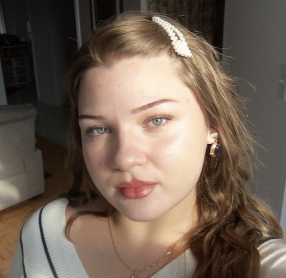

# Sevgul Ozturk 
 

**Graphic Design Student**

---

## About Me

I am a Graphic Design student with an interest in branding, editorial design, digital design, and visual storytelling. I enjoy creating clean and visually engaging designs while exploring typography, colour, layout, and imagery. I am currently developing my skills through school projects and creative design work.

[My LinkedIn Profile](https://www.linkedin.com/in/sevg%C3%BCl-%C3%B6zt%C3%BCrk-14b222231/)

## Education

**Humber Polytechnic — Graphic Design**
Etobicoke, Ontario
Expected Graduation: 2028

## Skills

* Adobe Illustrator
* Adobe Photoshop
* Adobe InDesign
* Figma
* HTML & CSS
* GitHub
* VS Code
* Typography & Layout
* Branding & Visual Identity
* Digital Design
* Editorial Design
* Basic Motion Design

## Selected Projects

**Taste of Anatolia — Cookbook Design**
Designed a cookbook concept focused on Turkish cuisine, including typography, layout, imagery, and visual identity.

**Lumelia Foundation — Charity Website**
Created a visual identity and website design concept for a breast cancer charity, including branding, page layouts, typography, and colour direction.

**Silver Pulse — Album Website**
Designed a responsive album website concept with a visual direction inspired by music, atmosphere, and digital experiences.

**Anna Karenina — Book Cover Design**
Developed a book cover concept using typography, composition, imagery, and visual storytelling.

## Interests

* Editorial & Magazine Design
* Branding
* Beauty & Fashion
* Typography
* Digital Media
* Photography
* Visual Storytelling

## References

Available upon request.
